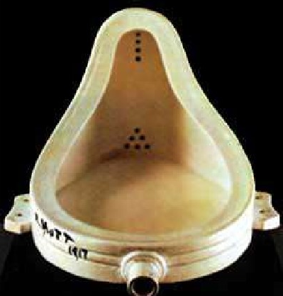
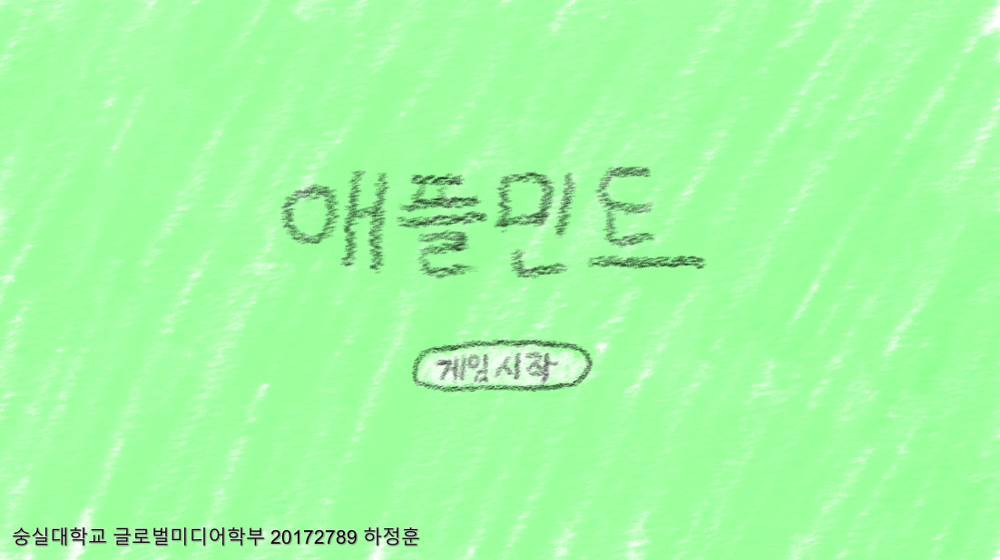
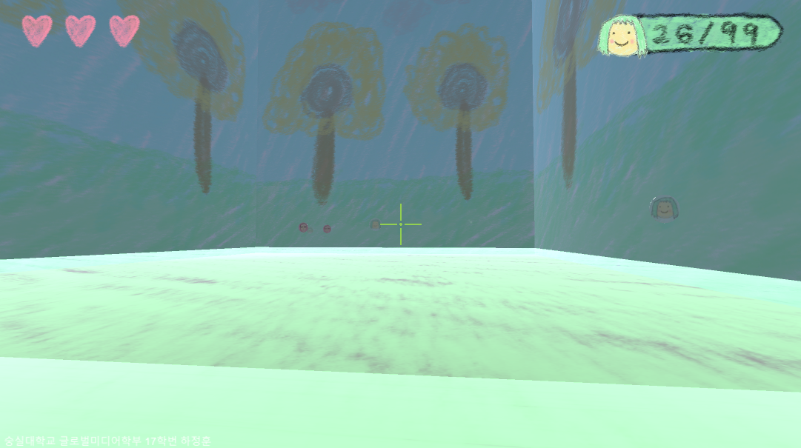
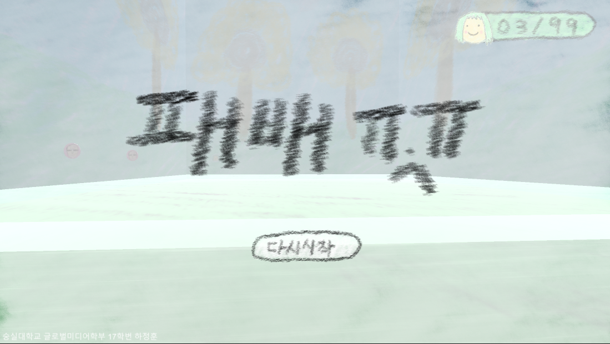
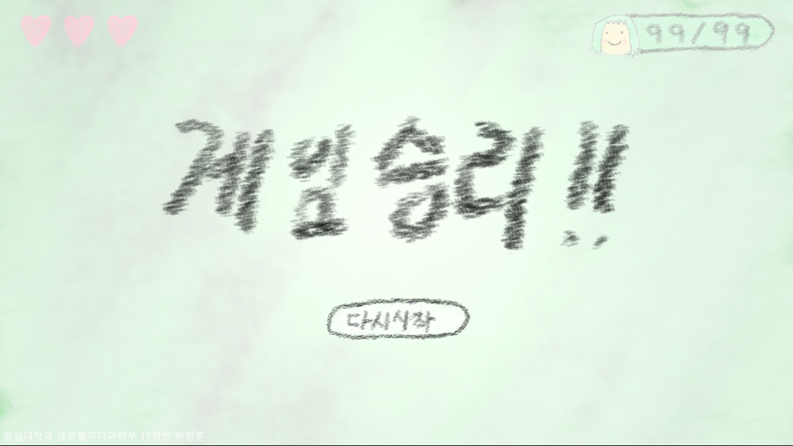

# applemint

Unity game, applemint

## 게임소개

FPS 디펜스 게임입니다. 총으로 끊임없이 몰려오는 악당들의 진입으로부터 보호하는 게임입니다.

## 기획의도

### 배운 것을 제대로 활용하기

저는 이번 게임개발방법론 과목을 통해 유니티를 제대로 배워본 것은 처음입니다. 그렇기에 중간과제를 통해 9주차까지 배운 것들을 최대한 활용해보는 것을 목표로 삼았습니다.

### 기획, 디자인의 철학

게임을 만들기에 있어서 여러가지 역량이 필요하다고 생각합니다. 예를 들어서 기획, 디자인, 프로그래밍 등등이 있겠습니다. 프로그래밍은 이재운 교수님의 게임개발방법론 강의를 통해 여러가지 배울 수 있었지만, 애석하게도 저는 기획이나 디자인의 역량이 부족하다고 생각합니다. 그렇기에 어떻게 하면 기획이나 디자인의 부재를 메꿀 수 있을까 고민했습니다.

이것은 뒤샹의 샘입니다. 변기와 같은 일상적 사물을 떼어서 갤러리에 놓으니 사람들에게 충격적 효과로 가져왔습니다. 일상적 사물은 대게 어떠한 다양한 의미를 해석하게 해주거나 이데올로기를 던져주지 않습니다. 우리가 어떤 행위를 하기 위한 수단으로 사용되지, 우리에게 어떤 의미로 해석되어지지 않습니다. 하지만 이 변기가 갤러리에 오고나서, 이 변기는 일상적 사물로서 의 의미가 박탈된, 기의가 없는 기표만 남아있는 기호로 새롭게 창조되었습니다. 저는 여기서부터 시작했습니다. 어떻게 하면 기획, 디자인의 부재가 있어도 훌륭한 작품을 만들 수 있을까?

### 디자인 컨셉

이것은 제가 그린 그림입니다. 마치 6세 아동이 크레파스로 작품을 그린듯한 형편없어 보이는 그림입니다. 하지만, 이런 그림들이 모여 전체적인 게임 스타일과 분위기를 자연스럽게 통일시키면 어떻게 될까 생각했습니다. 그렇게 '애플민트'라는 게임이 등장하게 되었습니다.
디자인의 연출은 의도적으로 포토샵의 브러쉬를 크레파스 효과로 입히고, 타블렛을 이용해 실제로 크레파스로 그린듯한 연출을 사용했습니다.

## 게임목적

빨간 대머리 악당을 물리치며 99명의 애플민트 머리의 시민을 무사히 보호하면 승리합니다. 시민을 타격하거나, 악당의 접근을 일정 이상 허용을 3회 이상 할 경우 패배합니다.

## 게임 조작 방법

왼쪽 이동 : A키
오른쪽 이동 : D키
앞으로 이동 : W키
뒤로 이동 : S키
총쏘기 공격 : 좌클릭

## 게임 스크린샷

## 참고

### 캐릭터

'애플민트'에 등장하는 두 캐릭터는 'Otaku's Adventure'라는 게임의 두 캐릭터를 참고하여 만들어졌습니다.

### 문서

이 문서는 markdown으로 작성되었습니다. 원본을 보려면 [링크](https://github.com/maemenaver/applemint/)을 확인하십시오.
